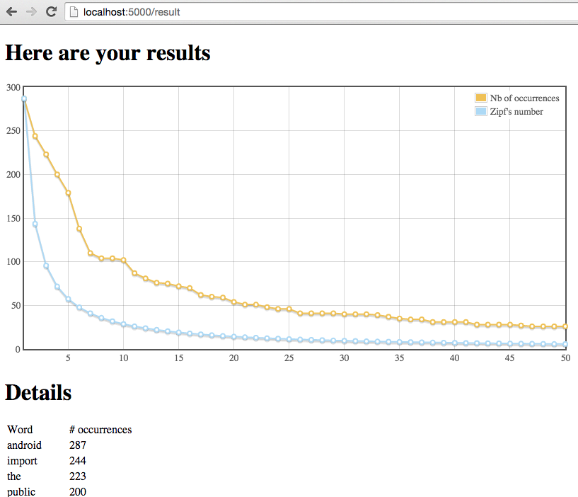

# ZIPF

Enter a Git repository to analyze its _Zipfness_.

* Run the program with `python zipf.py`
* Open your browser to `http://localhost:5000`
* Enter a GitHub repository
* View the results

# Zipf's Law
	
Zipf's law states that given some corpus of natural language utterances, the frequency of any word is inversely proportional to its rank in the frequency table. Thus the most frequent word will occur approximately twice as often as the second most frequent word, three times as often as the third most frequent word, etc.

* https://en.wikipedia.org/wiki/Zipf%27s_law Zipf's law on Wikipedia
* https://www.youtube.com/watch?v=fCn8zs912OE Zips's law by Vsauce
 
# Requirements

What you need prior to running this program:

* Python v2.7+
* `pip`
* `Flask` library
 
# License

Check the LICENSE file.
